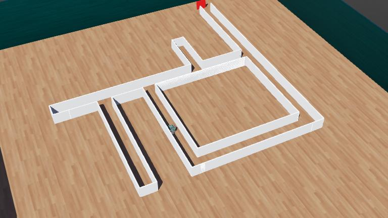

# MazeRunningAlgorithms

A Webots robotics simulation project implementing and comparing classic maze-solving algorithms using an **e-puck robot**. Built for AUBH Semester 8 Robotics.


_The e-puck robot (green) navigating the final maze toward the red goal marker in Webots._

---

## Overview

The robot uses proximity sensors to detect walls and a camera to detect the red goal marker. Three maze-solving strategies are implemented, ranging from simple reactive control to memory-based path exploration.

**Robot**: e-puck (2 drive wheels, 8 proximity sensors, RGB camera)  
**Simulator**: [Webots R2025a](https://cyberbotics.com)

---

## Algorithms

### 1. Wall Follower (`wall_follower/`)

A simple reactive controller that keeps the left wall in contact at all times.

- No memory or global state
- Works reliably on simply-connected mazes
- Enhanced variant (`walfollower_red/`) stops on red goal detection via camera

### 2. Pledge Algorithm (`PLEDGE/`, `PLEDGE_RED/`)

Guarantees maze exit even in multiply-connected (looping) mazes where pure wall-following fails.

- Picks a preferred compass direction and walks straight until hitting a wall
- Switches to left-hand wall-following, tracking a signed turn counter
- Exits wall-following only when the counter returns to zero — preventing circular traps
- `PLEDGE_RED` variant adds camera-based goal detection to stop at the red marker

### 3. Tremaux Algorithm (`treumax/`)

A memory-based algorithm that guarantees finding the exit by marking traversed corridors.

- Marks each corridor edge as unvisited → once-visited → twice-visited
- Prefers unvisited paths; backtracks on dead ends; never traverses a corridor a third time
- Guaranteed to find the exit in any maze topology

> **⚠️ Known Issue:** The current implementation produces incorrect wall detections ("hallucinations") due to the e-puck's sensor placement not aligning well with the maze cell boundaries. The proximity sensor readings for left/front/right openings are unreliable at junctions, causing wrong turn decisions. Further sensor threshold tuning or a dedicated maze layout is needed for reliable operation.

---

## Project Structure

```
MazeRunningAlgorithms/
├── controllers/
│   ├── wall_follower/        # Basic left-wall follower
│   ├── walfollower_red/      # Wall follower + red goal detection
│   ├── PLEDGE/               # Pledge algorithm
│   ├── PLEDGE_RED/           # Pledge + red goal detection
│   ├── treumax/              # Tremaux algorithm
│   ├── test/                 # Alternate Tremaux (cleaner, step-through)
│   └── calibration/          # Tuning tools for motor parameters
├── worlds/
│   ├── finalmaze.wbt         # Main maze (3.5×3.5 m, 29 wall segments)
│   └── maze_runner.wbt       # Simpler test maze (4×4 m)
└── plugins/
```

---

## Worlds

| World             | Controller    | Arena       | Description                                              |
| ----------------- | ------------- | ----------- | -------------------------------------------------------- |
| `finalmaze.wbt`   | PLEDGE_RED    | 3.5 × 3.5 m | Complex maze with 29 wall segments and a red goal marker |
| `maze_runner.wbt` | wall_follower | 4.0 × 4.0 m | Simple maze for initial algorithm testing                |

---

## Calibration

Key tunable parameters (set in each controller and calibrated via `controllers/calibration/`):

| Parameter            | Value     | Description                              |
| -------------------- | --------- | ---------------------------------------- |
| `FORWARD_STEPS_CELL` | 35        | Timesteps to move one maze cell forward  |
| `TURN_STEPS_90`      | 32        | Timesteps for a 90° turn                 |
| `TURN_STEPS_180`     | 68        | Timesteps for a 180° turn                |
| `WALL_THRESHOLD`     | 78–80     | Proximity sensor value indicating a wall |
| `TURN_SPEED`         | 0.6 × max | Angular speed during turns               |
| `FORWARD_SPEED`      | 0.7 × max | Linear speed during forward motion       |

---

## Getting Started

1. Install [Webots R2025a](https://cyberbotics.com/#download)
2. Clone this repository
3. Open Webots → **File → Open World** → select `worlds/finalmaze.wbt`
4. Press **Play** — the robot will start solving the maze automatically

To switch algorithms, open the world file, select the e-puck robot, and change the **controller** field to any of the controller folder names listed above.

---

## Algorithm Comparison

| Algorithm     | Memory            | Handles Loops | Guaranteed Exit      | Complexity |
| ------------- | ----------------- | ------------- | -------------------- | ---------- |
| Wall Follower | None              | No            | Only on simple mazes | Low        |
| Pledge        | Minimal (counter) | Yes           | Yes                  | Medium     |
| Tremaux       | Full edge map     | Yes           | No (needs tuning)    | High       |
